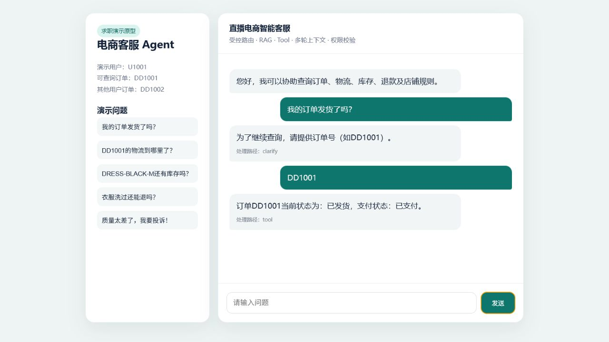
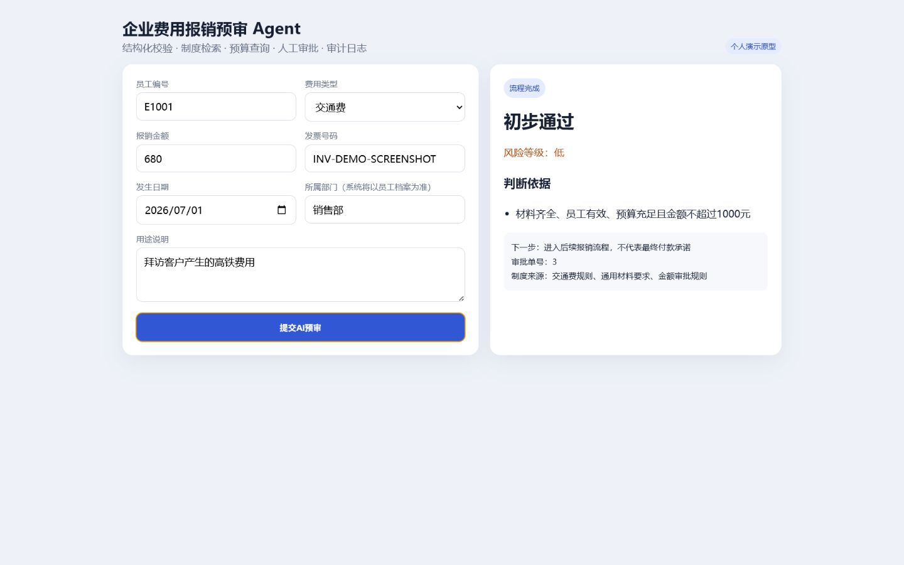
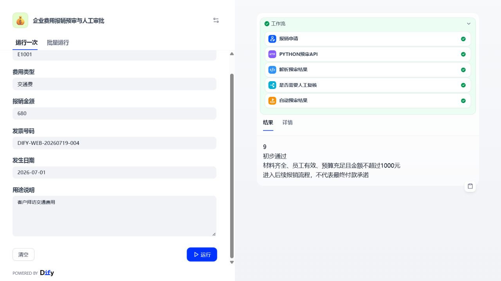
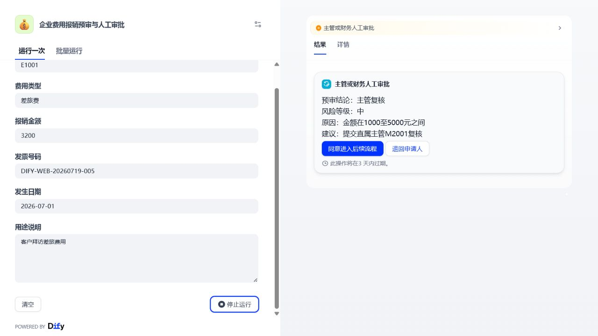

# AI Agent 业务应用作品集

面向 **AI应用搭建 / AI应用实施 / Agent应用开发 / 电商AI应用** 岗位的双项目作品集。重点展示业务流程拆解、受控 Tool 调用、RAG、工作流、权限校验、人工审批、审计日志、Docker 交付与项目文档能力。

## 项目概览

| 项目 | 业务场景 | 核心能力 | 演示地址 |
|---|---|---|---|
| 直播电商智能客服 Agent | 客服、订单、物流、库存、退款、投诉 | Router、RAG、4类 Tool、多轮上下文、订单归属校验、人工转接 | `http://127.0.0.1:5000` |
| 企业费用报销预审 Agent | 员工、预算、发票、金额规则、主管/财务审批 | 结构化校验、SQLite、确定性规则、制度检索、人工审批、审计日志、Dify DSL | `http://127.0.0.1:5100` |

## 演示截图

### 直播电商智能客服



### 企业费用报销预审



### Dify 工作流 Web App



### Dify 人工审批节点



## 一键启动

前置条件：Docker Desktop 已启动。

```powershell
docker compose up --build -d
docker compose ps
```

Compose 启动三个服务：

- `ecommerce-agent`：客服 Web 与 Agent 编排层。
- `ecommerce-mock-api`：模拟订单、物流、库存、退款业务系统。
- `expense-agent`：费用报销预审 Web 与规则层。

停止服务：

```powershell
docker compose down
```

## 已验证结果

- 两个项目共 15 个自动化测试通过。
- 三个容器可正常启动，两个 Web 服务健康检查为 `healthy`。
- 客服 Agent 可在首轮缺少订单号时追问，下一轮接收 `DD1001` 后调用 Tool 返回订单状态。
- 用户 `U2002` 查询不属于自己的 `DD1001` 时返回 `ACCESS_DENIED`。
- 报销 Agent 对有效员工、680元交通费和新发票号返回“初步通过”；中高风险申请进入主管或财务复核。
- 报销工作流已在本地 Dify `1.16.0` 完成导入、发布、自动预审和人工复核暂停验证。

## Dify 工作流

可导入 DSL：[`expense-approval-agent/dify/expense-approval-workflow.yml`](expense-approval-agent/dify/expense-approval-workflow.yml)

工作流职责分工：

```text
Dify表单与流程编排
  -> HTTP调用Python预审API
  -> Python校验员工/预算/发票/金额
  -> Dify解析结果与条件分支
  -> 低风险自动输出 / 中高风险人工审批
```

大模型或工作流不直接决定金额是否合规；确定性业务规则由 Python 层控制，高风险结论保留人工审批。

## 真实性边界

两个项目均为个人业务原型，使用模拟业务数据：

- 未接入抖店正式 API 或企业真实财务系统。
- 未在企业生产环境上线。
- 不宣称真实降本增效数据。
- Docker Compose 用于本地演示和工程化验证，不等同于生产部署。

详细文档：[`DOCKER.md`](DOCKER.md)、[`RUNTIME-VALIDATION.md`](RUNTIME-VALIDATION.md)。
