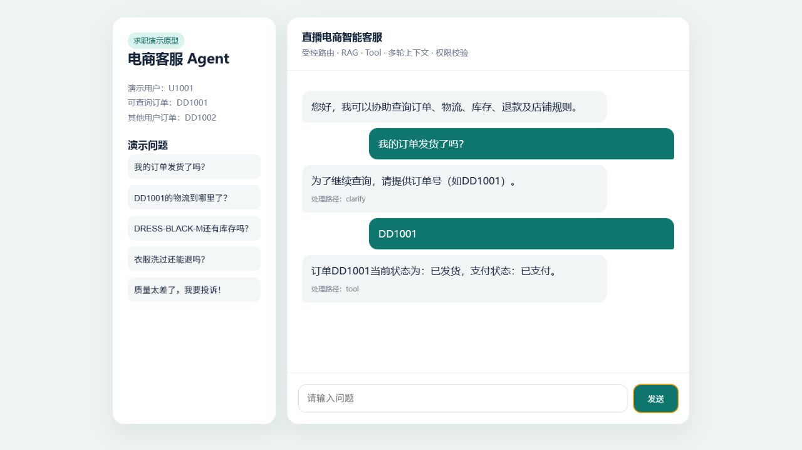
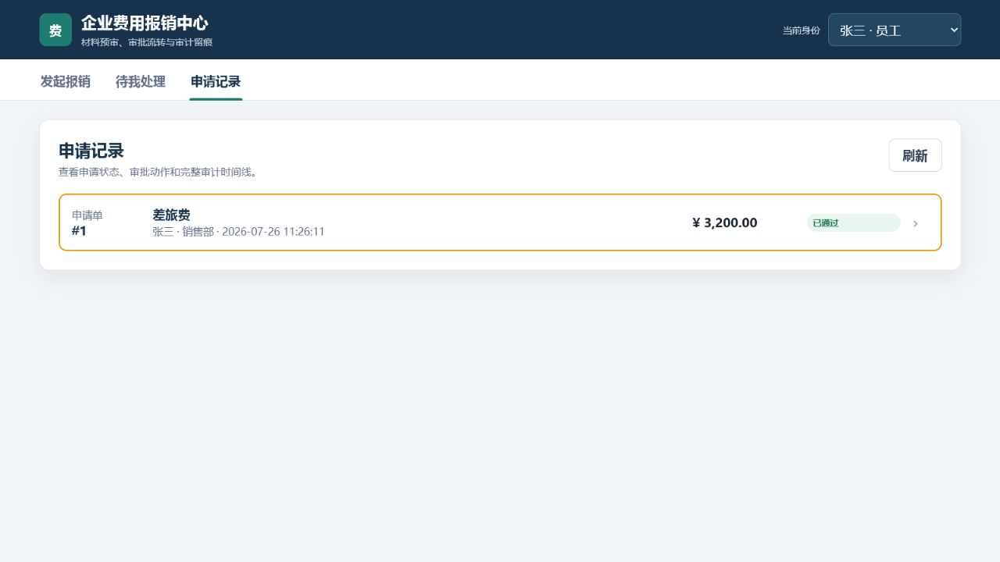

# AI Agent 业务应用作品集

面向 **AI应用搭建 / AI应用实施 / Agent应用开发 / 电商AI应用** 岗位的双项目作品集。两个项目都以“业务规则可控、关键动作可审计、异常可以人工接管”为设计原则，重点展示业务流程拆解、Router、RAG、Tool/API、权限、状态机、测试和本地交付能力。

## 项目概览

| 项目 | 业务场景 | 已实现的核心能力 | 本地地址 |
|---|---|---|---|
| 直播电商智能客服 Agent | 客服、订单、物流、库存、退款、投诉 | LLM/规则 Router、向量 RAG、4 类受控 Tool、多轮补参、订单归属校验、人工转接、审计日志 | `http://127.0.0.1:5000` |
| 企业费用报销审批 Agent | 员工申请、预算、发票、主管/财务审批 | 员工/主管/财务角色权限、审批状态机、退回重提、预算原子占用、DeepSeek 材料理解、阿里云 Embedding + Chroma 制度检索、审计时间线 | `http://127.0.0.1:5100` |

## 为什么不是“让大模型决定一切”

```text
用户输入
  ├─ 非结构化理解：大模型辅助识别意图或检查材料表达
  ├─ 制度问答：Embedding + 向量库检索制度依据
  ├─ 实时事实：受控 Tool / API / SQLite 查询
  ├─ 确定性约束：身份、权限、金额、预算、重复发票、状态机
  └─ 高风险与异常：主管、财务或客服人工接管
```

大模型输出只是一条建议，不能绕过业务 API、权限、参数校验和人工节点。客服项目不允许模型直接读取任意订单；报销项目不允许模型决定预算、金额合规或最终审批。

## 演示截图

### 直播电商智能客服



### 企业费用报销：真实 AI 材料理解与制度检索


### 企业费用报销：审批记录



## 一键启动

前置条件：Docker Desktop 已启动。

1. 将根目录 `.env.example` 复制为 `.env`，按需填写 DeepSeek 与阿里云 Model Studio 配置；不配置时系统会自动使用本地规则与关键词检索兜底。
2. 在仓库根目录执行：

```powershell
docker compose up --build -d
docker compose ps
```

Compose 启动三个服务：

- `ecommerce-agent`：客服 Web 与 Agent 编排层。
- `ecommerce-mock-api`：模拟订单、物流、库存、退款业务 API。
- `expense-agent`：费用报销 Web、规则、状态机和审批 API。

停止服务：

```powershell
docker compose down
```

## 测试与验收

- 直播电商智能客服：`28/28` 个自动化测试通过。
- 企业费用报销审批：`20/20` 个自动化测试通过。
- 合计：`48/48` 个自动化测试通过。
- 浏览器闭环已验证：员工提交 → 主管退回 → 员工补充并重提 → 主管同意 → 员工查看完整状态和审计记录。
- 联网路径已验证：DeepSeek 只生成材料摘要/补充建议，阿里云 `text-embedding-v4` + Chroma 返回制度依据；任一外部服务失败时自动进入明确标记的本地兜底路径。

## Dify 的定位

仓库保留一份可导入的 Dify DSL，用于展示 HTTP 节点、条件分支与人工节点的可视化编排。它是补充演示，不是报销系统的事实源。完整审批状态、角色权限、预算占用、退回重提和审计留痕由 Python + SQLite v2 系统负责。

DSL：[`expense-approval-agent/dify/expense-approval-workflow.yml`](expense-approval-agent/dify/expense-approval-workflow.yml)

## 真实性边界

两个项目均为个人业务原型，使用模拟业务数据：

- 未接入抖店正式 API 或企业真实财务系统。
- 未在企业生产环境上线。
- 不宣称真实降本增效数据。
- Docker Compose 用于本地演示和工程化验证，不等同于生产部署。
- 生产落地仍需企业 SSO、正式 API、密钥托管、权限矩阵、监控告警、备份容灾和数据合规评审。

详细文档：[`DOCKER.md`](DOCKER.md)、[`RUNTIME-VALIDATION.md`](RUNTIME-VALIDATION.md)、[`expense-approval-agent/README.md`](expense-approval-agent/README.md)。
