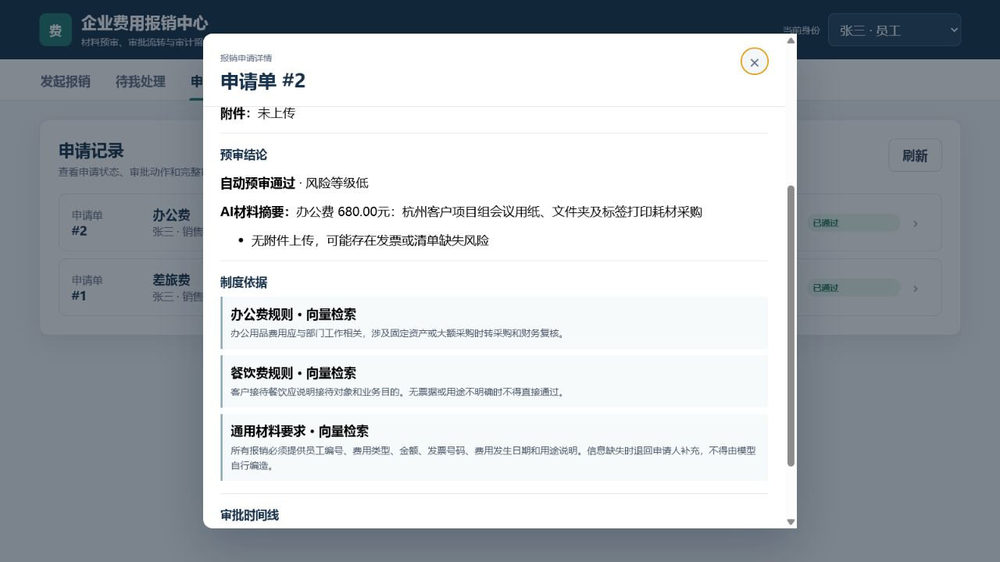
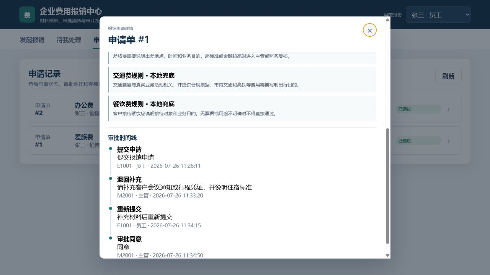

# 企业费用报销审批 Agent

这是一个可运行、可测试、可演示的个人业务原型。系统模拟员工提交报销、规则预审、主管/财务审批、退回补充、再次提交和审计留痕，不接入真实企业财务或付款系统。

## 当前界面与闭环证据

新版页面按员工、主管、财务三种身份呈现发起报销、待办处理和申请记录，不再使用旧版 Dify Web App 截图作为最终系统证据。

### AI材料摘要与制度依据



### 退回重提与审批审计时间线



## 业务流程

```text
当前登录身份
  -> 员工填写申请并上传票据
  -> 服务端绑定员工、部门和直属主管
  -> 必填项 / 日期 / 金额 / 费用类型 / 重复发票校验
  -> 员工状态与部门预算查询
  -> DeepSeek仅辅助检查用途说明
  -> 阿里云Embedding + Chroma检索制度依据
  -> 确定性规则决定审批路径
      ├─ 1000元及以下：自动预审通过
      ├─ 1000至5000元：直属主管审批
      └─ 超过5000元或预算不足：财务审批
  -> 同意 / 退回 / 驳回
  -> 退回后员工补充材料并重新提交
  -> SQLite保存申请、审批动作和审计时间线
```

## 已实现能力

### 真实角色与权限

- 员工只能提交和查看自己的申请。
- 主管只能查看、审批直属员工的主管待办。
- 财务只处理财务待办。
- 员工、部门、主管从服务端会话身份获得，不信任前端自行提交的身份字段。
- 附件绑定上传者，其他员工不能借用附件编号。

### 审批状态机

状态包括：

- `approved`
- `pending_manager`
- `pending_finance`
- `returned`
- `rejected`

所有审批动作都检查“当前状态 + 当前角色 + 申请归属”，避免越权、重复审批和错误状态跳转。退回申请可补充用途、日期或附件后重提。

### 数据与并发保护

- SQLite 存储员工、预算、附件、申请、审批动作和审计日志。
- 使用参数化 SQL。
- 发票号码唯一，处理并发重复提交。
- 审批通过时使用条件更新占用预算，避免并发超扣。
- 日志记录 actor、action、status、reason 和时间，不记录 API Key。

### AI 与 RAG 边界

- DeepSeek 仅检查用途表达、生成安全摘要和补充建议，不参与金额、预算或最终审批。
- 大模型输出会经过事实一致性校验；不能把已填写的费用类型、用途或非未来日期误报为缺失/未来。
- 阿里云 `text-embedding-v4` 负责制度向量化，Chroma 负责本地向量检索，并通过关键词轻量重排提高费用类型命中。
- 外部模型或向量服务不可用时，系统使用明确标记的 `rule_fallback` / `local_fallback`，不会冒充真实 AI 结果。

## 主要接口

| 方法 | 地址 | 作用 |
|---|---|---|
| GET | `/health` | 健康检查 |
| GET | `/api/demo-identities` | 获取演示身份 |
| GET | `/api/session` | 获取当前身份与权限 |
| POST | `/api/attachments` | 上传并绑定票据附件 |
| POST | `/api/applications` | 员工提交申请 |
| GET | `/api/applications` | 按身份列出记录或待办 |
| GET | `/api/applications/<id>` | 查看可访问的申请详情 |
| POST | `/api/applications/<id>/actions` | 主管/财务同意、退回或驳回 |
| POST | `/api/applications/<id>/resubmit` | 员工补充后重提 |
| POST | `/api/precheck` | 保留给 Dify HTTP 节点的兼容入口 |

页面演示使用 `X-User-Id` 模拟企业登录态。生产环境应由网关或 SSO 注入身份，不允许客户端任意切换。

## 本地运行

```powershell
python -m venv .venv
.\.venv\Scripts\Activate.ps1
pip install -r requirements.txt
Copy-Item .env.example .env
python app.py
```

访问：`http://127.0.0.1:5100`

没有配置外部模型时也可以运行；页面会显示本地兜底来源。

## Docker

在仓库根目录执行：

```powershell
Copy-Item .env.example .env
docker compose up --build -d
```

镜像构建上下文明确排除 `.env`、运行数据库、上传文件和虚拟环境，API Key 不会被复制进镜像。

## 自动化测试

```powershell
python -m unittest discover -s tests -v
```

当前 `20/20` 通过，覆盖角色可见范围、主管/财务审批、退回重提、附件归属、预算不足、预算扣减、发票重复与并发、日期/金额/用途规则、身份字段不可信、状态动作意见必填和审计记录。

## Dify

[`dify/expense-approval-workflow.yml`](dify/expense-approval-workflow.yml) 是补充工作流演示，用于解释 HTTP、条件分支和人工节点。v2 Python 系统才是审批状态、角色权限和审计事实源，Dify 不直接改预算，也不替代正式审批 API。

## 项目边界

- 全部员工、预算、票据和申请均为模拟数据。
- 自动预审通过不代表真实企业付款承诺。
- 未做发票验真、OCR、企业 SSO、正式财务系统对接和生产监控。
- 生产落地前需要业务制度确认、数据权限评审、接口签名、审批授权、备份容灾、灰度上线和运维 SLA。
